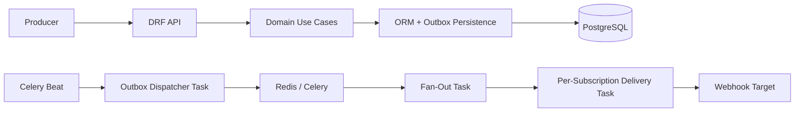

# Design

## Overview

This service centralizes webhook subscription management, event ingestion, fan-out,
and durable delivery for tenant-scoped business events such as `po.approved`,
`invoice.paid`, and `project.milestone_completed`.

The codebase follows Clean Architecture:

- `interface/` contains Django and DRF entry points, authentication, routing,
  and Celery task wrappers.
- `domain/` contains pure Python entities, business rules, repository
  interfaces, and use cases.
- `data/` contains Django ORM models, repository implementations, monitoring,
  encryption helpers, and the outbound HTTP gateway.

Dependency flow is inward:

`interface -> domain <- data`

The `domain` layer has zero Django, ORM, Celery, or HTTP client imports.

## Architecture

## Ingestion Choice

### Chosen approach

The service exposes a synchronous HTTP ingestion endpoint at `POST /api/events/`.
The request succeeds only after the event has been persisted in PostgreSQL inside
the service boundary.

For each accepted event:

1. authenticate the tenant principal from the API key
2. normalize or derive an idempotency key
3. check for an existing event with that tenant-scoped key
4. persist the event and an outbox row in one transaction
5. return success to the producer

This gives the producer a simple integration surface while preserving
at-least-once safety inside the service.

### Why this approach

- producers already know how to call HTTP APIs
- successful commits are not lost if Redis or Celery is unavailable
- duplicate producer submissions resolve to the same event instead of creating
  duplicate delivery attempts
- the queue handoff is decoupled from the producer response path

### Alternatives considered

- publish directly to Celery/Redis from the API request:
  rejected because an accepted request could still lose the event if broker
  publish failed after the HTTP response
- require producers to push into a dedicated broker:
  rejected for this scope because it raises the integration burden and was
  explicitly outside the target complexity

## Reliability Story

### Event durability

The event and outbox row are written in the same database transaction. If the
request returns success, the service has durable state from which processing can
resume later.

### Duplicate submission handling

Every event is tenant-scoped and keyed by an idempotency key. Producers may
send their own key; otherwise the service derives one from the tenant, event
type, and canonical payload. Replays return the existing event instead of
creating another outbox row.

### Fan-out safety

Fan-out is replay-safe. The worker loads the tenant's active subscriptions,
matches wildcard patterns, and creates at most one delivery attempt per
`(event, subscription)` pair. A uniqueness constraint plus replay-aware lookup
prevents duplicate delivery rows.

### Delivery safety

Each delivery attempt is claimed atomically before sending the outbound request.
If two workers race or duplicate Celery messages exist, only one worker gets the
attempt into `in_progress`; the others observe the persisted state and skip the
send.

### Retry behavior

Failed deliveries move through:

`pending -> in_progress -> failed/retrying -> success/dead_letter`

Retry timing uses capped exponential backoff with bounded jitter. Defaults are:

- base delay: `1s`
- max delay: `60s`
- jitter factor: `0.1`
- max retries: `5`

### Crash recovery

- if the API process crashes before commit: no event is acknowledged
- if the API process crashes after commit: beat later republishes the outbox row
- if fan-out crashes mid-run: replay reuses existing delivery attempts and
  enqueues only the remaining work
- if delivery crashes after claim but before terminal persistence: the attempt
  remains non-terminal and is eligible again according to claim rules and retry
  state

## Multi-Tenancy and Security

- every tenant-scoped model has a `tenant` foreign key
- repository queries enforce tenant filters instead of relying only on views
- runtime API access is authenticated with tenant API keys
- tenant identity is derived from the authenticated principal, never from the
  request body
- subscription secrets are generated once, shown once, encrypted at rest, and
  never returned on later reads
- outbound webhook payloads are signed with HMAC-SHA256 over
  `{timestamp}.{body}`

## Noisy Neighbour Handling

The current design separates ingestion from delivery and adds three protections:

- delivery tasks are routed into stable tenant queue buckets
- Celery rate limits apply to delivery tasks
- a per-tenant target circuit breaker opens after repeated failures and cools
  off before allowing a half-open probe

This is enough to avoid one tenant's failing endpoints blocking ingestion or
completely dominating a single worker path at this scope. It is still not a
full per-target fairness scheduler, but it materially reduces repeat calls to
broken endpoints.

## What We Cut

The following were intentionally left out or only partially addressed:

- stronger SLA-oriented scheduling guarantees such as sub-10-second delivery
  commitments under sustained load

Those can be layered on without changing the domain boundary.
