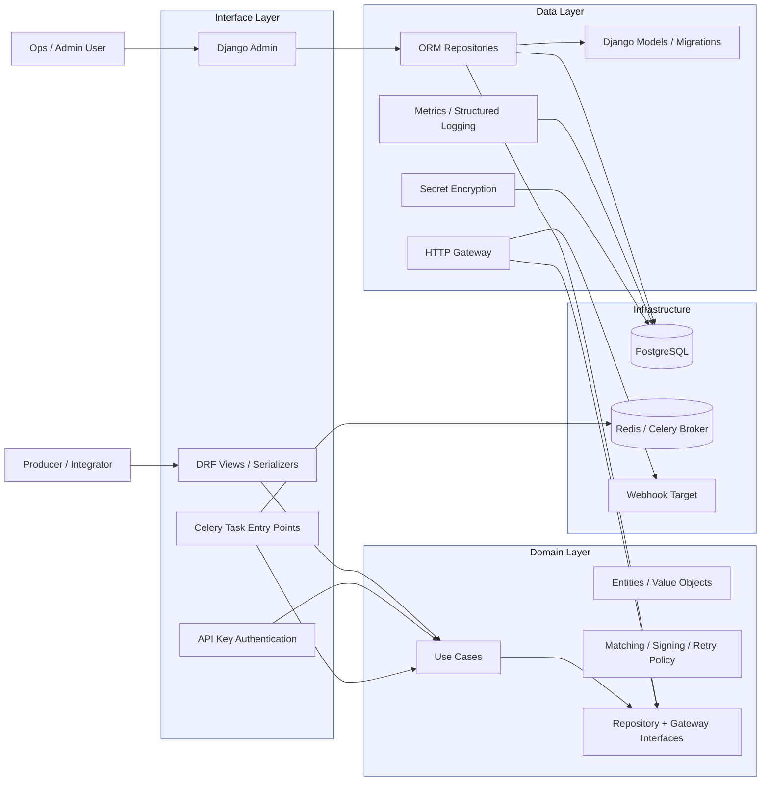
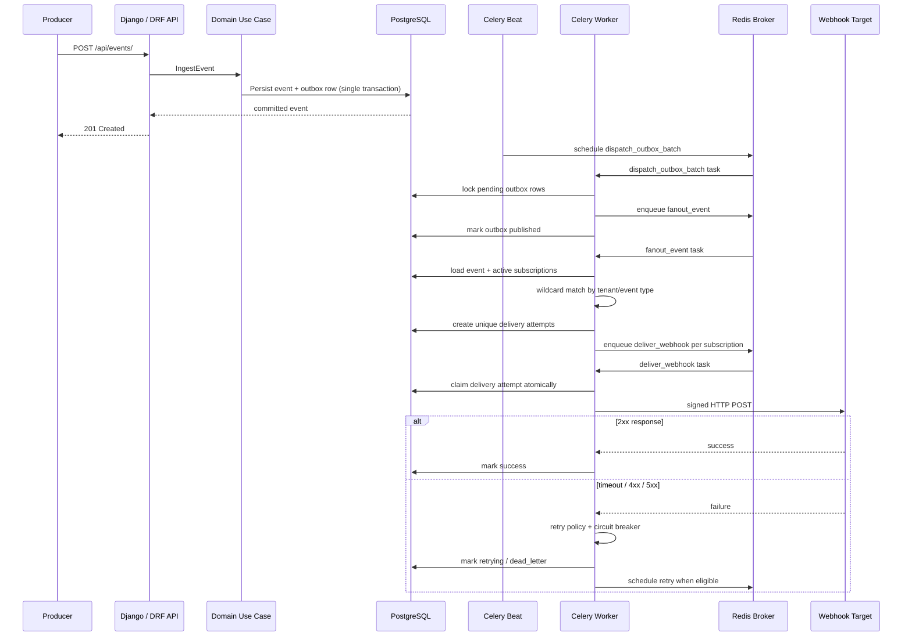
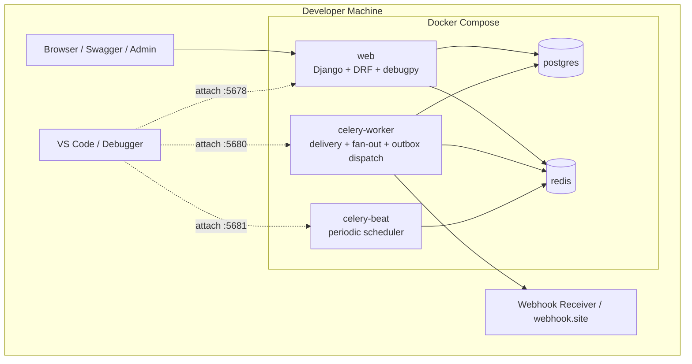

# Architecture Diagram

This document gives a graphical view of the webhook delivery service from three
angles:

- Clean Architecture layer boundaries
- runtime event-to-webhook flow
- local deployment topology

## 1. Layered Architecture

## 2. Runtime Delivery Flow

## 3. Local Deployment Topology

## 4. Reading Guide

- `Interface -> Domain <- Data` is the key dependency rule.
- PostgreSQL is the source of truth for events, subscriptions, attempts, and
  outbox rows.
- Redis/Celery handles asynchronous execution, not durable event ownership.
- The outbox table is what protects the system from losing accepted events if
  the broker is temporarily unavailable.
